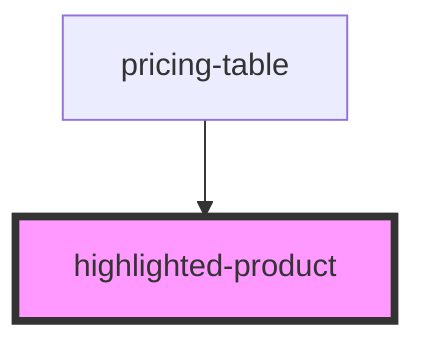

# highlighted-product

<!-- Auto Generated Below -->

## Properties

| Property  | Attribute | Description | Type      | Default     |
| --------- | --------- | ----------- | --------- | ----------- |
| `product` | --        |             | `Product` | `undefined` |

## Events

| Event            | Description | Type                   |
| ---------------- | ----------- | ---------------------- |
| `productClicked` |             | `CustomEvent<Product>` |

## Dependencies

### Used by

 - [pricing-table](..)

### Graph

----------------------------------------------

*Built with [StencilJS](https://stenciljs.com/)*
