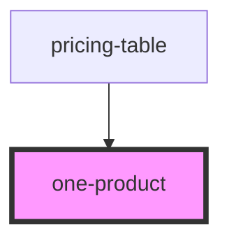

# one-product

<!-- Auto Generated Below -->

## Properties

| Property       | Attribute  | Description | Type                                                                                                                                                                                                                                                                                                                                                                                                         | Default     |
| -------------- | ---------- | ----------- | ------------------------------------------------------------------------------------------------------------------------------------------------------------------------------------------------------------------------------------------------------------------------------------------------------------------------------------------------------------------------------------------------------------ | ----------- |
| `product`      | --         |             | `ProductWithPrice`                                                                                                                                                                                                                                                                                                                                                                                           | `undefined` |
| `quantity`     | `quantity` |             | `number`                                                                                                                                                                                                                                                                                                                                                                                                     | `1`         |
| `translations` | --         |             | `{ most_popular: string; tiered_input: { label: string; }; recurrances: { day: string; days: string; week: string; weeks: string; month: string; months: string; year: string; years: string; }; free_trial: string; time: { day: string; days: string; week: string; weeks: string; month: string; months: string; year: string; years: string; }; actions: { buy_now: string; contact_sales: string; }; }` | `undefined` |

## Events

| Event            | Description | Type                            |
| ---------------- | ----------- | ------------------------------- |
| `productClicked` |             | `CustomEvent<ProductWithPrice>` |

## Dependencies

### Used by

 - [pricing-table](..)

### Graph

----------------------------------------------

*Built with [StencilJS](https://stenciljs.com/)*
