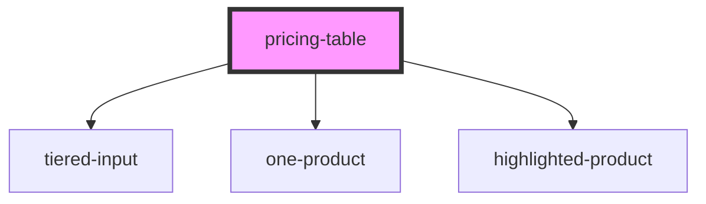

# my-component

<!-- Auto Generated Below -->

## Properties

| Property          | Attribute           | Description  | Type                                                                                                                                                                                                                                                                                                                                                                                                                                                                      | Default     |
| ----------------- | ------------------- | ------------ | ------------------------------------------------------------------------------------------------------------------------------------------------------------------------------------------------------------------------------------------------------------------------------------------------------------------------------------------------------------------------------------------------------------------------------------------------------------------------- | ----------- |
| `currency`        | `currency`          |              | `string`                                                                                                                                                                                                                                                                                                                                                                                                                                                                  | `'mxn'`     |
| `extraProducts`   | --                  |              | `Product[]`                                                                                                                                                                                                                                                                                                                                                                                                                                                               | `[]`        |
| `hideTieredInput` | `hide-tiered-input` |              | `boolean`                                                                                                                                                                                                                                                                                                                                                                                                                                                                 | `false`     |
| `prices`          | --                  |              | `Price[]`                                                                                                                                                                                                                                                                                                                                                                                                                                                                 | `[]`        |
| `products`        | --                  | The products | `Product[]`                                                                                                                                                                                                                                                                                                                                                                                                                                                               | `[]`        |
| `translations`    | --                  |              | `{ most_popular: string; tiered_input: { label: string; }; currency: string; currencies: { mxn: string; usd: string; }; recurrances: { day: string; days: string; week: string; weeks: string; month: string; months: string; year: string; years: string; }; free_trial: string; time: { day: string; days: string; week: string; weeks: string; month: string; months: string; year: string; years: string; }; actions: { buy_now: string; contact_sales: string; }; }` | `undefined` |

## Dependencies

### Depends on

- [tiered-input](tiered-input)
- [one-product](one-product)
- [highlighted-product](highlighted-product)

### Graph

----------------------------------------------

*Built with [StencilJS](https://stenciljs.com/)*
