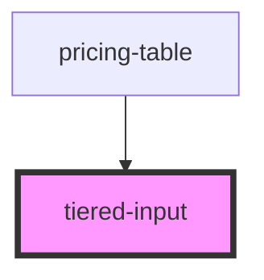

# tiered-input

<!-- Auto Generated Below -->

## Properties

| Property   | Attribute  | Description | Type               | Default     |
| ---------- | ---------- | ----------- | ------------------ | ----------- |
| `label`    | `label`    |             | `string`           | `undefined` |
| `onInput`  | --         |             | `(e: any) => void` | `undefined` |
| `quantity` | `quantity` |             | `number`           | `1`         |

## Dependencies

### Used by

 - [pricing-table](..)

### Graph

----------------------------------------------

*Built with [StencilJS](https://stenciljs.com/)*
